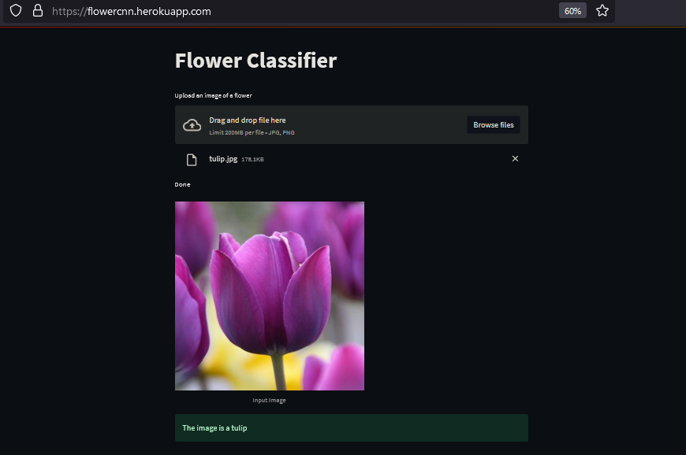

# image-classification
In this Flower classification CNN model, I tried to fix the overfitting problem with the Data augmentation and Drop out method. 

## Deploy with Streamlit
to run Streamlit locally first, you need to go to the project directory where app.py stores, then run this command: `streamlit run app.py`

## Deploy with Heroku

you need to add this file to deploy to Heroku:
* Procfile
* requirements.txt
* setup.sh

